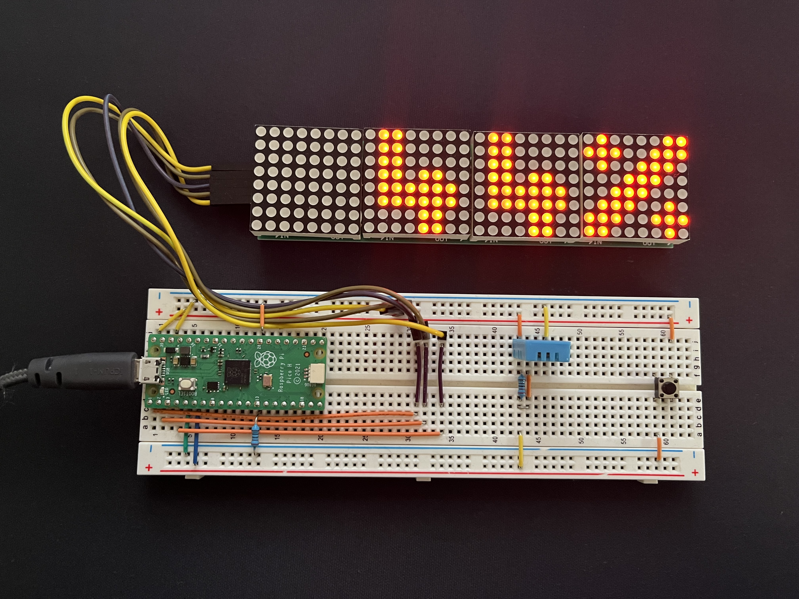

# LED Matrix Clock with Raspberry Pi Pico

## Project Overview

This is a Project, that is using a Raspberry Pi Pico (RP2040) to control a Matrix LED Clock.

The Matrix Display is a 4 Segment 8x8 Matrix, using a MAX7219 for each Segment as a Controller.

I wrote all necessary functions myself, I used the linked Documentation and 
[Pico Examples](https://github.com/raspberrypi/pico-examples) as an inspiration on how to use the Pi Pico functions.

## Controlls

The Button is used to switch between Time, Temperature and Humidity. A long press is switching to set minutes mode.
In set minute mode a normal press in increasing the minutes, another long press goes to set hours mode, that also increases the value with a normal press.
Another Long press goes back to the normal mode, with this switch the new time will be set and the seconds will be set to 0.

## Font

The Font I created for the Matrix. 

|  |      |        |      | |
|:------------------------------:|:----------------------------------:|:------------------------------------:|:----------------------------------:|:-----------------------------:|
  |      |        |      | |
|                                |  |  |  |

|    Mode     |                Normal Value                 |                  Invalid Value                  |
|:-----------:|:-------------------------------------------:|:-----------------------------------------------:|
|    Time     |       |                      - - -                      |
| Temperature |  |  |
|  Humidity   |       |       |

## Circuit

## Parts

|         **Part**         |
|:------------------------:|
|     Raspberry Pi Pico    |
| 4x Segment 8x8 Matrix LED |
|          DHT 11          |
|          Button          |
|     2x 10kΩ  Resistor    |
|  Breadboard and Cables   |

## Documentation

|                                                      **Part**                                                       |                                      
|:-------------------------------------------------------------------------------------------------------------------:|
|          [Raspberry Pi Pico C SDK]( https://datasheets.raspberrypi.com/pico/raspberry-pi-pico-c-sdk.pdf )           |  
|                 [RP2040 Datasheet](https://datasheets.raspberrypi.com/rp2040/rp2040-datasheet.pdf)                  |
| [DHT11 Datasheet](https://www.mouser.com/datasheet/2/758/DHT11-Technical-Data-Sheet-Translated-Version-1143054.pdf) |                                      
|                 [MAX7219 Datasheet](https://pdfserv.maximintegrated.com/en/ds/MAX7219-MAX7221.pdf)                  |                                      

## How to use the SDK

A Guide and all necessary links can be found [here](https://www.raspberrypi.com/documentation/microcontrollers/c_sdk.html).

To be able to compile this project you have to:

1. Install the [Packages for your System](https://github.com/raspberrypi/picotool).
2. Add the [PI Pico SDK](https://github.com/raspberrypi/pico-sdk) to your cmake environment.
3. Copy `external/pico_sdk_import.cmake` from the SDK to this project folder.

